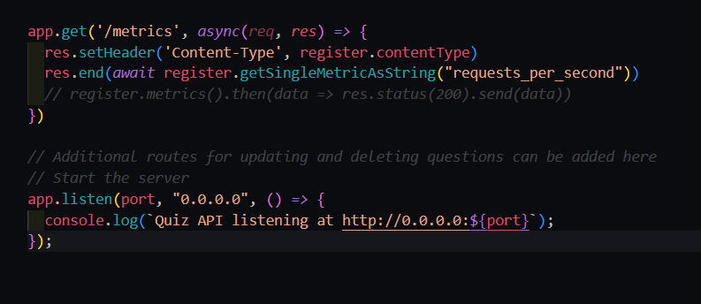

# Autoscaling-with-custom-metrics

# Introduction

Managing fluctuating workloads in a Kubernetes cluster can be a challenge. Traditional scaling methods often require manual intervention, leading to inefficiencies and potential performance issues. This project introduces an autoscaling system that utilizes custom metrics to  automatically scale deployments based on real-time application demands.

This system leverages the power of Prometheus for metric collection and visualization, along with a Prometheus adapter and Horizontal Pod Autoscalers (HPA) for dynamic scaling. We'll explore how these components work together to create a robust and efficient autoscaling solution tailored to your specific application needs.

By the end of this project, you'll gain a comprehensive understanding of how to:

* Implement custom metric collection using the prom-client library.
* Configure Prometheus and the Prometheus adapter to register and expose custom metrics.
* Utilize Horizontal Pod Autoscalers (HPA) to automatically scale deployments based on custom metrics and resource utilization.

# Overview

Here, the backend will be connected to a mongodb deployment, to store and retrieve the data into database. The backend will utilize the prom-client library to emit metrics through an endpoint. Metrics come in four primary types: Counter, Gauge, Histogram, and Summary. In this case, we'll leverage counter metrics to track the number of `requests per second (requests_per_second)`.

Whenever the `/api/questions` endpoint is accessed, the requests_per_second counter metric increments by one using the code `newCounter.labels({requests_times_get: res.statusCode}).inc()`. However, unlike gauges or summaries, counter metric values do not persist across application restarts or process resets. They simply accumulate the total count since the metric's creation.

To observe the current value of the `requests_per_second metric`, we can access the `/metrics` endpoint exposed by the application. Prometheus leverages this endpoint through a ServiceMonitor to scrape and store the metric data for further analysis and visualization.

**Setting Up Prometheus and the Prometheus Operator**

The first step involves deploying the Prometheus operator and its associated Custom Resource Definitions (CRDs) into your Kubernetes cluster. These CRDs define the desired state for Prometheus and related resources.

We'll create a Prometheus object with the kind set to Prometheus. This object will be configured to look for ServiceMonitors with the label `app=deploy` within a namespace that also has the label `app=deploy`. Additionally, a service account will be associated with the Prometheus object to provide necessary permissions for accessing endpoints

The backend application will be deployed within the quiz namespace, labeled with `app=deploy` for identification by Prometheus. A ServiceMonitor resource will also be deployed in the quiz namespace. This ServiceMonitor specifically targets the backend service (backend) and scrapes metrics exposed at the `/metrics` endpoint.

The ServiceMonitor acts as a bridge between the application and Prometheus. It instructs Prometheus to periodically scrape the `/metrics` endpoint of the backend service, collecting the exposed metrics (including the `requests_per_second` counter) for processing and storage by the Prometheus operator.

**Promethus adapter**

The Prometheus adapter acts as a mediator between Prometheus and the Kubernetes API server. Its primary function is to retrieve custom metrics from Prometheus and expose them as official Kubernetes metrics accessible by Horizontal Pod Autoscalers (HPA).

Here's how it works:

Configuration: The Prometheus adapter deployment includes arguments under its spec, specifying the Prometheus URL `(e.g., --prometheus-url=http://prometheus-operator.monitoring:9090)`. This URL directs the adapter to the Prometheus instance where the custom metrics are stored.

Service Account: Additionally, a service account is associated with the adapter deployment. This service account grants the adapter the necessary permissions (e.g., access to namespaces, pods, and services) to interact with the Kubernetes API server and register the custom metrics.

By retrieving metrics from Prometheus and registering them with the Kubernetes API server, the Prometheus adapter essentially "translates" them into a format understandable by HPAs.

A ConfigMap resource will be attached to the Prometheus adapter deployment. This ConfigMap plays a crucial role in informing the adapter about the custom metrics it needs to translate and register. It essentially defines a mapping between the custom metrics and their corresponding Kubernetes API representation.

The ConfigMap typically includes the following details:

* Metric Name: The name of the custom metric as exposed by the application (e.g., requests_per_second).

* Resource Kind: Specifies the Kubernetes resource type this metric represents (e.g., pods or namespaces).

* Metric Query: This leverages Prometheus' powerful metric query language, PromQL, to retrieve the desired    metric data from Prometheus. 

You can refer to the [PromQL documentation](https://prometheus.io/docs/prometheus/latest/querying/basics/) for detailed information on constructing effective metric queries.

The metric query within the ConfigMap instructs the adapter on how to precisely extract the relevant metric data from Prometheus for registration with the Kubernetes API server.

A ConfigMap resource will be attached to the Prometheus adapter deployment. This ConfigMap plays a crucial role in informing the adapter about the custom metrics it needs to translate and register. It essentially defines a mapping between the custom metrics and their corresponding Kubernetes API representation.

The ConfigMap typically includes the following details for the requests_per_second metric:

* Metric Name: requests_per_second (matches the name exposed by the application)
* Resource Kind: This depends on how you want HPA to interpret the metric. It could be pods or a custom       resource kind specific to your application. 
* Metric Query: This leverages PromQL to retrieve the desired metric data from Prometheus. 
`'sum(rate(<<.Series>>{<<.LabelMatchers>>}[2m])) by (<<.GroupBy>>)'`

**Explanation of the Metric Query:**

* sum(rate(...)): This part calculates the rate of the metric over a specific time window (2 minutes in this case). The rate function helps convert the counter metric (requests_per_second) into a rate of requests per second.
* <<.Series>>: This represents the actual metric name retrieved from Prometheus (likely requests_per_second).
* <<.LabelMatchers>>: This part allows specifying any label matchers to filter the series further based on specific labels. If no filtering is needed, it can be left empty.
* <<.GroupBy>>: This defines how to group the results. Here, it's likely left empty as we're interested in the overall rate of requests.

For custom metrics, we will create an apiservice to look after the promethus adapter service to register the custom metrics to be used by the HPA.

To get what are the custom metrics registered, the command could be

`kubectl get --raw /apis/custom.metrics.k8s.io/v1beta1 | jq .`

**Cadvisor**

We will be using cadvisor to get the resource metrics such as cpu and memory from the containers which will further to be used by HPA to scale up the replicas based on the usage. The cadvisor is deployed as a daemonset, which is required to be present at each node to get the metrics. A service and servicemonitor will be deployed too to send the metrics to the promethus operator. A serviceaccount to provide permission for podsecurity policy is added to the daemonset.

Since, we are using cadvisor to get the resource metrics, we will configure the configmap to check the resources like cpu and memory. 

Another apiservice is created to register the resource metrics from directory `prom-adapter` named `resource-metrics`.

**Integrating Cadvisor for Resource Monitoring**
To enable HPA to scale pods based on resource utilization (CPU and memory), we'll leverage Cadvisor. Cadvisor is a container monitoring tool that collects resource usage data from containers.

**Cadvisor Deployment:**

A DaemonSet deployment ensures Cadvisor runs on every node in the cluster, collecting container resource metrics.
A Service and ServiceMonitor are deployed alongside Cadvisor.
The Service exposes Cadvisor's metrics endpoint.
The ServiceMonitor instructs Prometheus to scrape metrics from the Cadvisor service, making them available for analysis.
A ServiceAccount associated with the Cadvisor DaemonSet grants the necessary permissions (e.g., for pod security policy) to access container resource data.
Configuring the Prometheus Adapter for Resource Metrics:

Since we're using Cadvisor, the ConfigMap for the Prometheus adapter will need adjustments to handle resource metrics:

Metric Names: No specific names are needed here as Cadvisor exposes standard metrics for CPU and memory usage.
Resource Kind: Set to pods as the metrics represent resource utilization per pod.
Metric Queries: Leverage PromQL to retrieve CPU and memory usage from Cadvisor metrics exposed by Prometheus. Refer to Prometheus documentation for specific queries related to Cadvisor metrics.
Registering Resource Metrics:

An additional API service named resource-metrics will be created within the prom-adapter directory. This API service serves as a registration point for the resource metrics retrieved from Cadvisor via Prometheus.

By integrating Cadvisor and configuring the Prometheus adapter accordingly, HPA can access both custom metrics (requests_per_second) and resource metrics (CPU, memory) to make informed decisions about scaling the application deployment.

**Registering Resource Metrics:**

An additional API service named resource-metrics will be created within the prom-adapter directory. This API service serves as a registration point for the resource metrics retrieved from Cadvisor via Prometheus.

By integrating Cadvisor and configuring the Prometheus adapter accordingly, HPA can access both custom metrics (requests_per_second) and resource metrics (CPU, memory) to make informed decisions about scaling the application deployment.

*** Horizontal Pod Autoscaler (HPA) for Dynamic Scaling ***

The final step involves creating an HPA object within the quiz namespace. This HPA acts as the decision-maker for scaling the backend deployment based on resource utilization and custom metrics.

**HPA Configuration:**

Metrics Source: The HPA will be configured to retrieve metrics from the API service exposed by the Prometheus adapter (named resource-metrics).
Target Deployment: The HPA will target the backend deployment running in the quiz namespace.
Scaling Rules: The HPA defines two primary scaling rules:
Requests per Second: This rule monitors the requests_per_second metric exposed by the Prometheus adapter. If the average rate of requests per second exceeds a predefined threshold (e.g., 10 milliseconds on average, which can be adjusted), the HPA will initiate scaling up the deployment by adding replicas.
CPU Utilization: This rule monitors the average CPU utilization of the backend pods. If the average CPU usage surpasses a set threshold (e.g., 75 millic cores, which can be customized), the HPA will trigger scaling up.

# Conclusion

The projects delineate an autoscaling system for a Kubernetes cluster using custom metrics. The system leverages Prometheus for metric collection and visualization, a Prometheus adapter to register custom metrics, and Horizontal Pod Autoscalers (HPA) to scale pods based on resource utilization and custom metrics like request count. By combining these tools, the system ensures that the application can handle fluctuating loads by automatically scaling the number of pods in the deployment.

This approach offers several benefits:

Improved Scalability: The system automatically scales the application based on demand, preventing performance bottlenecks during peak loads.
Efficient Resource Utilization: By scaling pods up and down, the system optimizes resource utilization and reduces costs.
Enhanced Monitoring and Visibility: Prometheus provides comprehensive monitoring capabilities, allowing you to track key metrics and identify potential issues.

Overall, this autoscaling system with custom metrics provides a robust and efficient solution for managing application workloads in a Kubernetes environment.
